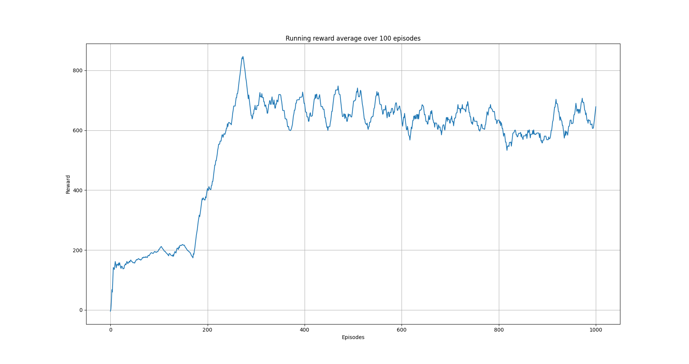
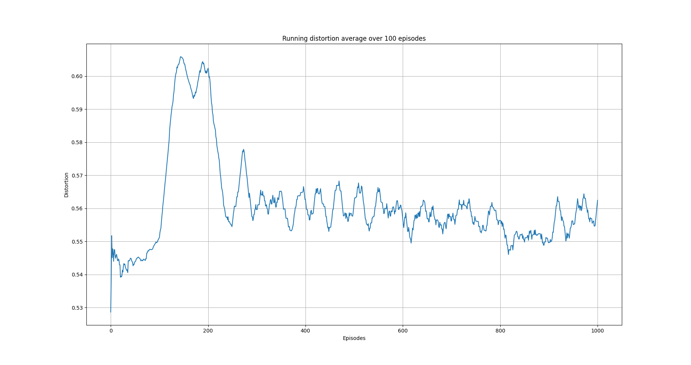

A2C algorithm on mock data set
==============================

Overview
--------

Both the Q-learning algorithm we used in `Q-learning on a three columns dataset <qlearning_three_columns.html>`_ and the SARSA algorithm in 
`Semi-gradient SARSA on a three columns data set <semi_gradient_sarsa_three_columns.html>`_ are value-based methods; that is they estimate directly value functions. Specifically the state-action function
:math:`Q`. By knowing :math:`Q` we can construct a policy to follow for example to choose the action that at the given state
maximizes the state-action function i.e. :math:`argmax_{\alpha}Q(s_t, \alpha)` i.e. a greedy policy. These methods are called off-policy methods. 

However, the true objective of reinforcement learning is to directly learn a policy  :math:`\pi`. One class of algorithms towards this directions are policy gradient algorithms
like REINFORCE and Advantage Actor-Critic or A2C algorithms. A review of A2C methods can be found in [1].

A2C algorithm
-------------

Typically with policy gradient methods and A2C in particular, we approximate directly the policy by a parameterized model.
Thereafter, we train the model i.e. learn its paramters by taking samples from the environment. 
The main advantage of learning a parameterized policy is that it can be any learnable function e.g. a linear model or a deep neural network.

The A2C algorithm  is a the synchronous version of A3C [2]. Both algorithms, fall under the umbrella of actor-critic methods. In these methods, we estimate a parameterized policy; the actor
and a parameterized value function; the critic. The role of the policy or actor network is to indicate which action to take on a given state. In our implementation below,
the policy network returns a probability distribution over the action space. Specifically,  a tensor of probabilities. The role of the critic model is to evaluate how good is
the action that is selected.

In our implementation we use a shared-weights model and use a single agent that interacts with multiple instances of the
environment. In other words, we create a number of workers where each worker
loads its own instance of the data set to anonymize. 

The objective of the agent is to maximize the expected discounted return [2]: 

.. math:: 

   J(\pi_{\theta}) = E_{\tau \sim \rho_{\theta}}\left[\sum_{t=0}^T\gamma^t R(s_t, a_t)\right]
   
where :math:`\tau` is the trajectory the agent observes with probability distribution :math:`\rho_{\theta}`, :math:`\gamma` is the 
discount factor and :math:`R(s_t, \alpha_t)` represents some unknown to the agent reward function. We can rewrite the expression above as

.. math:: 

   J(\pi_{\theta}) = E_{\tau \sim \rho_{\theta}}\left[\sum_{t=0}^T\gamma^t R(s_t, a_t)\right] = \int \rho_{\theta} (\tau) \sum_{t=0}^T\gamma^t R(s_t, a_t) d\tau

Let's condense the involved notation by using :math:`G(\tau)` to denote the sum in the expression above i.e.

.. math::

   G(\tau) = \sum_{t=0}^T\gamma^t R(s_t, a_t)
   
The probability distribution :math:`\rho_{\theta}` should be a function of the followed policy :math:`\pi_{\theta}` as this dictates what action is followed. Indeed we can write  [2],

.. math::

   \rho_{\theta} = p(s_0) \Pi_{t=0}^{\infty} \pi_{\theta}(a_t, s_t)P(s_{t+1}| s_t, a_t)

  
where :math:`P(s_{t+1}| s_t, a_t)` denotes the state transition probabilities. 
Policy gradient methods use the gardient of :math:`J(\pi_{\theta})` in order to make progress. It turns out, see for example [2, 3] that we can write

.. math::

   \nabla_{\theta} J(\pi_{\theta}) = \int \rho_{\theta}  \nabla_{\theta} log (\rho_{\theta})  G(\tau) d\tau

This equation above forms the essence of the policy gradient methods. However, we cannot fully evaluate the integral above as we don't know the transition probabilities.  We can eliminate the 
term that involves the gradient :math:`\nabla_{\theta}\rho_{\theta}` by using the expression for :math:`\rho_{\theta}`

.. math::
   
   \nabla_{\theta}log(\rho_{\theta}) = \nabla_{\theta}log\left[p(s_0) \Pi_{t=0}^{\infty} \pi_{\theta}(a_t, s_t)P(s_{t+1}| s_t, a_t)\right]

From the expression above only the term :math:`\pi_{\theta}(a_t, s_t)` involves :math:`\theta`. Thus,

.. math::
 
   \nabla_{\theta}log(\rho_{\theta}) = \sum_{t=0}^{\infty} \nabla_{\theta}log(\pi_{\theta}(a_t, s_t)

We will use the expression above as well as batches of trajectories in order to calculate the integral above. In particular,
we will use the following expression

.. math::

   \nabla_{\theta} J(\pi_{\theta}) \approx \frac{1}{N}\sum_{i=1}^{N}\left( \sum_{t=0}^{T} \nabla_{\theta}log(\pi_{\theta}(a_t, s_t) \right) G(\tau)
   
where :math:`N` is the size of the batch. There are various expressions for :math:`G(\tau)` (see e.g. [4]) . Belowe, we review some of them. 
The first expression is given by 

.. math::

   G(\tau) = \sum_{t=0}^T\gamma^t R(s_t, a_t)
   
and this is the expression used by the REINFORCE algorithm [2].  However, this is a full Monte Carlo estimate and  when :math:`N` is small the gradient estimation may exhibit high variance. In such cases learning may not be stable.  Another expression we could employ is known as the reward-to-go term [2]:

.. math::

   G(\tau) = \sum_{t^{'} = t}^T\gamma^t R(s_{t^{`}}, a_{t^{`}})
   
Another idea is to use a baseline in order to reduce further the gradient variance [2]. One such approach is to use the so-called advantage function :math:`A(s_t, \alpha_t)` defined  as [2]

.. math::
	
	A(s_t, a_t) = Q_{\pi}(s_t, a_t) - V_{\pi}(s_t)
	
	
The advantage function measures how much the agent is better off by taking action :math:`a_t` when in state :math:`s_t` as opposed to following the existing policy. 
Let's see how we can estimate the advantage function.

Estimate :math:`A(s_t, a_t)`
----------------------------

The advantage function involes both the state-action value function :math:`Q_{\pi}(s_t, a_t)` as well as the value function :math:`V_{\pi}(s_t)`.
Given a model that somehow estimates :math:`V_{\pi}(s_t)`, we can estimate  :math:`Q_{\pi}(s_t, a_t)` from

.. math::

   Q_{\pi}(s_t, a_t) \approx G(\tau)
   
or 

.. math::

   Q_{\pi}(s_t, a_t) \approx r_{t+1} + \gamma V_{\pi}(s_{t+1})
   
Resulting in 

.. math::

   A(s_t, a_t) = r_{t+1} + \gamma V_{\pi}(s_{t+1}) - V_{\pi}(s_t)

GAE 
----

The advantage actor-critic model we use in this section involves a more general form of the advanatge estimation known as Generalized Advantage Estimation  or GAE.
This is a method for estimating targets for the advantage function [3]. Specifically, we use the following expression for the advantage function [4]

.. math::

   A(s_t, a_t)^{GAE(\gamma, \lambda)} = \sum_{l=0}^{\infty}(\gamma\lambda)^l \delta_{t+1}

when :math:`\lambda=0` this expression results to the the expression for :math:`A(s_t, a_t)` [4].

A2C model
---------

As we already mentioned, in actor-critic methods, there are two models; the actor
and the critic. The role of the policy or actor model is to indicate which action to take on a given state
There are two main architectures for actor-critic methods; completely isolated actor and critic models or weight sharing models [2].
In the former, the two models share no common aspects. The advantage of such an approach is that it is usually more stable.
The second architecture allows for the two models to share some characteristics and differentiate in the last layers. Although this second option
requires careful tuning of the hyperparameters, it has the advantage of cross learning and use common extraction capabilities [2].

In this example, we will follow the second architecture. Moreover, to speed up training, we will use a multi-process environment
that gathers samples from multiple environments at once.

The loss function, we minimize is a weighted sum of the two loss functions of the participating models i.e.

.. math::

   L(\theta) = w_1 L_{\pi}(\theta) + w_2 L_{V_{\pi}}(\theta)

where

.. math::

   L_{\pi}(\theta) = J(\pi(\theta)) ~~  L_{V_{\pi}}(\theta) = MSE(y_i, V_{\pi}(s_i))

where :math:`MSE` is the mean square error function and :math:`y_i` are the state-value targets i.e.

.. math::

   y_i = r_i + \gamma V_{\pi}(s_{i}^{'}), ~~ i = 1, \cdots, N
   
   
Code
----

.. code-block::

	import random
	from pathlib import Path
	import numpy as np
	import torch

	from src.algorithms.a2c import A2C, A2CConfig
	from src.networks.a2c_networks import A2CNetSimpleLinear
	from src.examples.helpers.load_full_mock_dataset import load_discrete_env, get_ethinicity_hierarchy, \
	    get_gender_hierarchy, get_salary_bins, load_mock_subjects
	from src.datasets import ColumnType
	from src.spaces.env_type import DiscreteEnvType
	from src.spaces.action_space import ActionSpace
	from src.spaces.actions import ActionIdentity, ActionStringGeneralize, ActionNumericBinGeneralize
	from src.utils.iteration_control import IterationControl
	from src.examples.helpers.plot_utils import plot_running_avg
	from src.spaces.multiprocess_env import MultiprocessEnv
	from src.trainers.pytorch_trainer import PyTorchTrainer, PyTorchTrainerConfig
	from src.maths.optimizer_type import OptimizerType
	from src.maths.pytorch_optimizer_config import PyTorchOptimizerConfig
	from src.utils import INFO
	
.. code-block::

	N_STATES = 10
	N_ITRS_PER_EPISODE = 400
	ACTION_SPACE_SIZE = 10
	N_WORKERS = 3
	N_EPISODES = 1001
	GAMMA = 0.99
	ALPHA = 0.1
	PUNISH_FACTOR = 2.0
	MAX_DISTORTION = 0.7
	MIN_DISTORTION = 0.4
	SAVE_DISTORTED_SETS_DIR = "/home/alex/qi3/drl_anonymity/src/examples/a2c_all_cols_multi_state_results/distorted_set"
	USE_IDENTIFYING_COLUMNS_DIST = True
	IDENTIFY_COLUMN_DIST_FACTOR = 0.1
	OUT_OF_MAX_BOUND_REWARD = -1.0
	OUT_OF_MIN_BOUND_REWARD = -1.0
	IN_BOUNDS_REWARD = 5.0
	OUTPUT_MSG_FREQUENCY = 100
	N_ROUNDS_BELOW_MIN_DISTORTION = 10
	N_COLUMNS = 11
	
.. code-block::

	def env_loader(kwargs):

	    column_types = {"NHSno": ColumnType.IDENTIFYING_ATTRIBUTE,
		            "given_name": ColumnType.IDENTIFYING_ATTRIBUTE,
		            "surname": ColumnType.IDENTIFYING_ATTRIBUTE,
		            "gender": ColumnType.QUASI_IDENTIFYING_ATTRIBUTE,
		            "dob": ColumnType.SENSITIVE_ATTRIBUTE,
		            "ethnicity": ColumnType.QUASI_IDENTIFYING_ATTRIBUTE,
		            "education": ColumnType.SENSITIVE_ATTRIBUTE,
		            "salary": ColumnType.QUASI_IDENTIFYING_ATTRIBUTE,
		            "mutation_status": ColumnType.SENSITIVE_ATTRIBUTE,
		            "preventative_treatment": ColumnType.SENSITIVE_ATTRIBUTE,
		            "diagnosis": ColumnType.INSENSITIVE_ATTRIBUTE}

	    # define the action space
	    action_space = ActionSpace(n=ACTION_SPACE_SIZE)

	    # all the columns that are SENSITIVE_ATTRIBUTE will be kept as they are
	    # because currently we have no model
	    # also INSENSITIVE_ATTRIBUTE will be kept as is
	    # in order to declare this we use an ActionIdentity
	    action_space.add_many(ActionIdentity(column_name="dob"),
		                  ActionIdentity(column_name="education"),
		                  ActionIdentity(column_name="salary"),
		                  ActionIdentity(column_name="diagnosis"),
		                  ActionIdentity(column_name="mutation_status"),
		                  ActionIdentity(column_name="preventative_treatment"),
		                  ActionIdentity(column_name="ethnicity"),
		                  ActionStringGeneralize(column_name="ethnicity",
		                                         generalization_table=get_ethinicity_hierarchy()),
		                  ActionStringGeneralize(column_name="gender",
		                                         generalization_table=get_gender_hierarchy()),
		                  ActionNumericBinGeneralize(column_name="salary",
		                                             generalization_table=get_salary_bins(ds=load_mock_subjects(),
		                                                                                  n_states=N_STATES)))
	    # shuffle the action space
	    # using different seeds
	    action_space.shuffle(seed=kwargs["rank"] + 1)

	    env = load_discrete_env(env_type=DiscreteEnvType.MULTI_COLUMN_STATE, n_states=N_STATES,
		                    min_distortion={"ethnicity": 0.133, "salary": 0.133, "gender": 0.133,
		                                    "dob": 0.0, "education": 0.0, "diagnosis": 0.0,
		                                    "mutation_status": 0.0, "preventative_treatment": 0.0,
		                                    "NHSno": 0.0, "given_name": 0.0, "surname": 0.0},
		                    max_distortion={"ethnicity": 0.133, "salary": 0.133, "gender": 0.133,
		                                    "dob": 0.0, "education": 0.0, "diagnosis": 0.0,
		                                    "mutation_status": 0.0, "preventative_treatment": 0.0,
		                                    "NHSno": 0.1, "given_name": 0.1, "surname": 0.1},
		                    total_min_distortion=MIN_DISTORTION, total_max_distortion=MAX_DISTORTION,
		                    out_of_max_bound_reward=OUT_OF_MAX_BOUND_REWARD,
		                    out_of_min_bound_reward=OUT_OF_MIN_BOUND_REWARD,
		                    in_bounds_reward=IN_BOUNDS_REWARD,
		                    punish_factor=PUNISH_FACTOR,
		                    column_types=column_types,
		                    action_space=action_space,
		                    save_distoreted_sets_dir=SAVE_DISTORTED_SETS_DIR,
		                    use_identifying_column_dist_in_total_dist=USE_IDENTIFYING_COLUMNS_DIST,
		                    use_identifying_column_dist_factor=IDENTIFY_COLUMN_DIST_FACTOR,
		                    gamma=GAMMA,
		                    n_rounds_below_min_distortion=N_ROUNDS_BELOW_MIN_DISTORTION)

	    # we want to get the distances as states
	    # not bin indices
	    env.config.state_as_distances = True

	    return env
	    
.. code-block::

	def action_sampler(logits: torch.Tensor) -> torch.distributions.Distribution:

	    action_dist = torch.distributions.Categorical(logits=logits)
	    return action_dist

.. code-block::

	if __name__ == '__main__':
	    # set the seed for random engine
	    random.seed(42)

	    # set the seed for PyTorch
	    torch.manual_seed(42)

	    # this the A2C network
	    net = A2CNetSimpleLinear(n_columns=N_COLUMNS, n_actions=ACTION_SPACE_SIZE)

	    # agent configuration
	    a2c_config = A2CConfig(action_sampler=action_sampler, n_iterations_per_episode=N_ITRS_PER_EPISODE,
		                   a2cnet=net, save_model_path=Path("./a2c_three_columns_output/"),
		                   n_workers=N_WORKERS,
		                   optimizer_config=PyTorchOptimizerConfig(optimizer_type=OptimizerType.ADAM,
		                                                           optimizer_learning_rate=ALPHA))

	    # create the agent
	    agent = A2C(a2c_config)

	    # create a trainer to train the Qlearning agent
	    configuration = PyTorchTrainerConfig(n_episodes=N_EPISODES)

	    # set up the arguments
	    env = MultiprocessEnv(env_builder=env_loader, env_args={}, n_workers=N_WORKERS)

	    try:

		env.make(agent=agent)
		trainer = PyTorchTrainer(env=env, agent=agent, config=configuration)

		# train the agent
		trainer.train()

		avg_rewards = trainer.total_rewards
		plot_running_avg(avg_rewards, steps=100,
		                 xlabel="Episodes", ylabel="Reward",
		                 title="Running reward average over 100 episodes")

		avg_episode_dist = np.array(trainer.total_distortions)
		print("{0} Max/Min distortion {1}/{2}".format(INFO, np.max(avg_episode_dist), np.min(avg_episode_dist)))

		plot_running_avg(avg_episode_dist, steps=100,
		                 xlabel="Episodes", ylabel="Distortion",
		                 title="Running distortion average over 100 episodes")
		                 
		                 
		# play the agent on the environment.
        	# call the environment builder to create
        	# an instance of the environment
        	discrte_env = env.env_builder()

        	stop_criterion = IterationControl(n_itrs=10, min_dist=MIN_DISTORTION, max_dist=MAX_DISTORTION)
        	agent.play(env=discrte_env, criteria=stop_criterion)

	    except Exception as e:
		print("An excpetion was thrown...{0}".format(str(e)))
	    finally:
		env.close()

Results
--------

The following images show the performance of the learning process

   
   Running average reward.
   
   

   
   Running average total distortion.
   

References
----------

1. Ivo Grondman, Lucian Busoniu, Gabriel A. D. Lopes, Robert Babuska, A survey of Actor-Critic reinforcement learning: Standard and natural policy gradients. IEEE Transactions on Systems, Man and Cybernetics-Part C Applications and Reviews, vol 12, 2012.
2. Enes Bilgin, Mastering reinforcement learning with python. Packt Publishing.
3. Miguel Morales, Grokking deep reinforcement learning. Manning Publications.
4. John Schulman, Philipp Moritz, Sergey Levine, Michael Jordan, Pieter Abbeel, `High-Dimensional Continuous Control Using Generalized Advantage Estimation <https://arxiv.org/abs/1506.02438>`_, Last download 26/04/2022.
