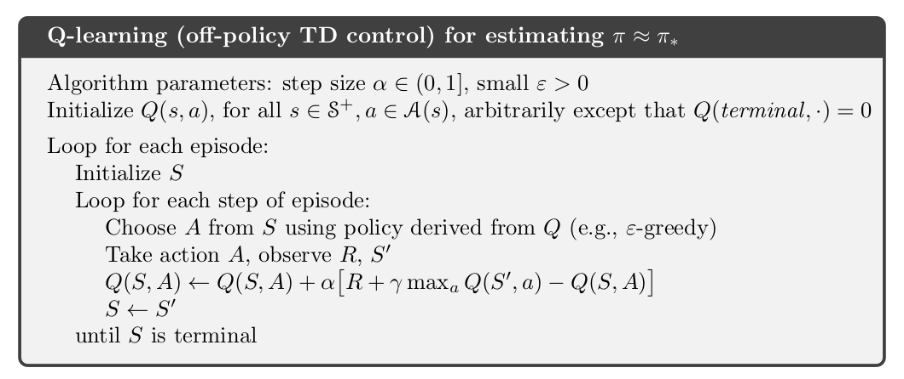
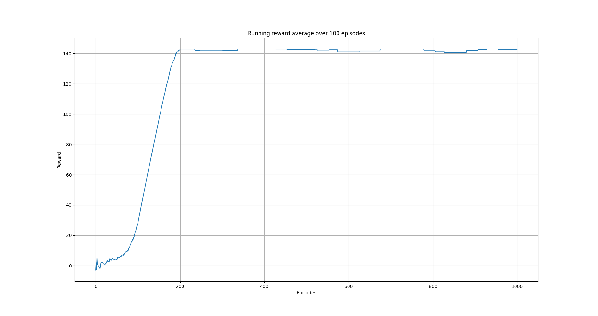
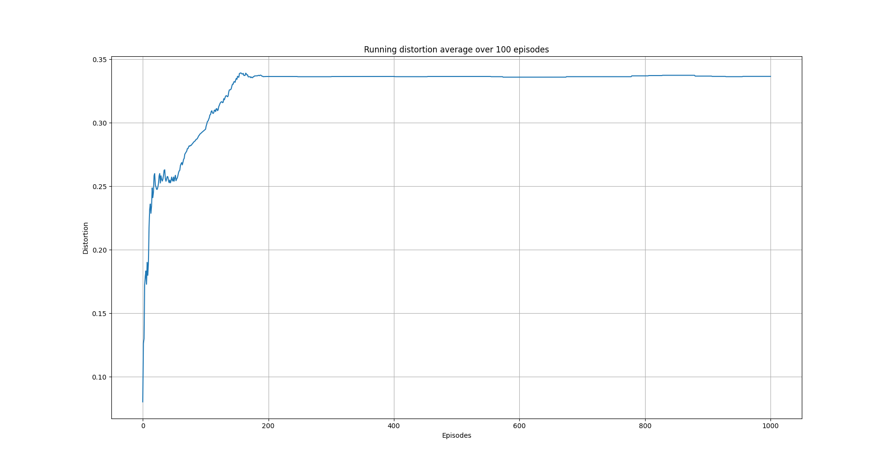

Q-learning on a three columns dataset
=====================================

Overview
--------

In this example, we use a tabular Q-learning algorithm to anonymize a data set with three columns.
In particular, we discretize the total dataset distortion into bins. Another approach could be 
to discretize the distortion of each column into bins and create tuples of indeces representing a state.
We follow the latter approach in another example. 

Q-learning
----------

Q-learning is one of the early breakthroughs in the field of reinforcement learning [1]. It was first introduced in [2].
Q-learning is an off-policy algorithm where the learned state-action value function :math:`Q(s, \alpha)` directly approximates
the optimal state-action value function :math:`Q^*`. This is done independently of the policy :math:`\pi`  being followed [1].

The Q-learning algorithm is an iterative algorithm where we iterate over a number of episodes. At each episode
the algorithm steps over the environment for a user-specified number steps it executes an action which results
in a new state and an observed state. This is shown collectively in the image below

   Q-learning algorithm. Image from [1].

At each episode step, the algorithm updates :math:`Q(s, \alpha)` according to:

.. math::
   Q(s_t, \alpha_t) = Q(s_t, \alpha_t)  + \alpha  \left[r_{t+1} + \gamma max_{\alpha} Q(s_{t+1}, \alpha) - Q(s_t, \alpha_t)\right]
   
where :math:`\alpha` is a user-defined learning factor and :math:`\gamma` is the user-defined discount factor. The algorithm requires the following user-defined input

- Number of episodes
- Number of steps per episode
- :math:`\gamma`
- :math:`\alpha`
- An external policy function to decide which action to take (e.g. :math:`\epsilon`-greedy)

Although with Q-learning :math:`Q(s, \alpha)` directly approximates :math:`Q^*` independently of the policy :math:`\pi`  being followed,
the policy still has an effect in that it determines which state-action pairs and visited updated. 
However, for correct convergence all that is required is that all pairs continue to be updated [1]. In fact, any method guaranteed to find optimal behavior in the general case must require it [1]. 

The algorithm above,  stores the expected value estimate for each state-action pair in a table.
This  means you cannot use it when we have continuous states or actions, which would lead to an array of infinite length.
Given that the total dataset distortion is assumed to be in the range :math:`[0, 1]` of the real numbers, we 
discretize this range into bins and for each entailed value of the distortion we use the corresponding bin as a state index. 
Alternatively, we could discretize the distortion of each column into bins and create tuples of indeces representing a state.

We preprocess the data set by normalizing the numeric columns. 
We will use the cosine normalized distance to measure the distortion of columns with string data.
Similarly, we use the following :math:`L_2`-based norm for calculating the distortion of
numeric columns

.. math::

	dist(\mathbf{v}_1, \mathbf{v}_2) = \sqrt{\frac{||\mathbf{v}_1 - \mathbf{v}_2||_{L_2}}{N}}

where $N$ is the size of the vector.	 This way the resulting distance, due to the normalization of numeric columns, will be in the range :math:`[0,1]`.

Code
----

The necessary imports

.. code-block::

	import numpy as np
	import random

	from src.trainers.trainer import Trainer, TrainerConfig
	from src.algorithms.q_learning import QLearning, QLearnConfig
	from src.spaces.action_space import ActionSpace
	from src.spaces.actions import ActionIdentity, ActionStringGeneralize, ActionNumericBinGeneralize
	from src.policies.epsilon_greedy_policy import EpsilonGreedyPolicy, EpsilonDecayOption
	from src.utils.iteration_control import IterationControl
	from src.examples.helpers.plot_utils import plot_running_avg
	from src.datasets import ColumnType
	from src.examples.helpers.load_three_columns_mock_dataset import load_discrete_env, \
	    get_ethinicity_hierarchy, get_salary_bins, load_mock_subjects
	from src.spaces.env_type import DiscreteEnvType
	from src.utils import INFO

Next establish a set of configuration parameters

.. code-block::

	# configuration params
	EPS = 1.0
	EPSILON_DECAY_OPTION = EpsilonDecayOption.CONSTANT_RATE  # .INVERSE_STEP
	EPSILON_DECAY_FACTOR = 0.01
	GAMMA = 0.99
	ALPHA = 0.1
	N_EPISODES = 1001
	N_ITRS_PER_EPISODE = 30
	N_STATES = 10
	# fix the rewards. Assume that any average distortion in
	# (0.3, 0.7) suits us
	MAX_DISTORTION = 0.7
	MIN_DISTORTION = 0.3
	OUT_OF_MAX_BOUND_REWARD = -1.0
	OUT_OF_MIN_BOUND_REWARD = -1.0
	IN_BOUNDS_REWARD = 5.0
	OUTPUT_MSG_FREQUENCY = 100
	N_ROUNDS_BELOW_MIN_DISTORTION = 10
	SAVE_DISTORTED_SETS_DIR = "q_learning_three_columns_results/distorted_set"
	PUNISH_FACTOR = 2.0

The dirver code  brings all the elements together

.. code-block::

	if __name__ == '__main__':

	    # set the seed for random engine
	    random.seed(42)

	    # set the seed for random engine
	    random.seed(42)

	    column_types = {"ethnicity": ColumnType.QUASI_IDENTIFYING_ATTRIBUTE,
		            "salary": ColumnType.QUASI_IDENTIFYING_ATTRIBUTE,
		            "diagnosis": ColumnType.INSENSITIVE_ATTRIBUTE}

	    action_space = ActionSpace(n=5)
	    # all the columns that are SENSITIVE_ATTRIBUTE will be kept as they are
	    # because currently we have no model
	    # also INSENSITIVE_ATTRIBUTE will be kept as is
	    action_space.add_many(ActionIdentity(column_name="salary"),
		                  ActionIdentity(column_name="diagnosis"),
		                  ActionIdentity(column_name="ethnicity"),
		                  ActionStringGeneralize(column_name="ethnicity",
		                                         generalization_table=get_ethinicity_hierarchy()),
		                  ActionNumericBinGeneralize(column_name="salary",
		                                             generalization_table=get_salary_bins(ds=load_mock_subjects(),
		                                                                                  n_states=N_STATES)))

	    env = load_discrete_env(env_type=DiscreteEnvType.TOTAL_DISTORTION_STATE, n_states=N_STATES,
		                    action_space=action_space,
		                    min_distortion=MIN_DISTORTION, max_distortion=MIN_DISTORTION,
		                    total_min_distortion=MIN_DISTORTION, total_max_distortion=MAX_DISTORTION,
		                    punish_factor=PUNISH_FACTOR, column_types=column_types,
		                    save_distoreted_sets_dir=SAVE_DISTORTED_SETS_DIR,
		                    use_identifying_column_dist_in_total_dist=False,
		                    use_identifying_column_dist_factor=-100,
		                    gamma=GAMMA,
		                    in_bounds_reward=IN_BOUNDS_REWARD,
		                    out_of_min_bound_reward=OUT_OF_MIN_BOUND_REWARD,
		                    out_of_max_bound_reward=OUT_OF_MAX_BOUND_REWARD,
		                    n_rounds_below_min_distortion=N_ROUNDS_BELOW_MIN_DISTORTION)

	    # save the data before distortion so that we can
	    # later load it on ARX
	    env.save_current_dataset(episode_index=-1, save_index=False)

	    # configuration for the Q-learner
	    algo_config = QLearnConfig(gamma=GAMMA, alpha=ALPHA,
		                       n_itrs_per_episode=N_ITRS_PER_EPISODE,
		                       policy=EpsilonGreedyPolicy(eps=EPS, n_actions=env.n_actions,
		                                                  decay_op=EPSILON_DECAY_OPTION,
		                                                  epsilon_decay_factor=EPSILON_DECAY_FACTOR))

	    agent = QLearning(algo_config=algo_config)

	    trainer_config = TrainerConfig(n_episodes=N_EPISODES, output_msg_frequency=OUTPUT_MSG_FREQUENCY)
	    trainer = Trainer(env=env, agent=agent, configuration=trainer_config)
	    trainer.train()

	    # avg_rewards = trainer.avg_rewards()
	    avg_rewards = trainer.total_rewards
	    plot_running_avg(avg_rewards, steps=100,
		             xlabel="Episodes", ylabel="Reward",
		             title="Running reward average over 100 episodes")

	    avg_episode_dist = np.array(trainer.total_distortions)
	    print("{0} Max/Min distortion {1}/{2}".format(INFO, np.max(avg_episode_dist), np.min(avg_episode_dist)))

	    plot_running_avg(avg_episode_dist, steps=100,
		             xlabel="Episodes", ylabel="Distortion",
		             title="Running distortion average over 100 episodes")

	    print("=============================================")
	    print("{0} Generating distorted dataset".format(INFO))
	    # Let's play
	    env.reset()

	    stop_criterion = IterationControl(n_itrs=10, min_dist=MIN_DISTORTION, max_dist=MAX_DISTORTION)
	    agent.play(env=env, stop_criterion=stop_criterion)
	    env.save_current_dataset(episode_index=-2, save_index=False)
	    print("{0} Done....".format(INFO))
	    print("=============================================")
	   
Results
-------

The following images show the performance of the learning process

   
   Running average reward.
   
   

   
   Running average total distortion.

Although there is evidence of learning, it should be noted that this depends heavily on the applied transformations on the columns and the
metrics used. So typically, some experimentation should be employed in order to determine the right options.

The following is snapshot of the distorted dataset produced by the agent

.. code-block::

	ethnicity,salary,diagnosis
	British,0.3333333333333333,1
	British,0.1111111111111111,0
	British,0.5555555555555556,3
	British,0.5555555555555556,3
	British,0.1111111111111111,0
	British,0.1111111111111111,1
	British,0.1111111111111111,4
	British,0.3333333333333333,3
	British,0.1111111111111111,4
	British,0.3333333333333333,0
	Asian,0.1111111111111111,0
	British,0.1111111111111111,0
	British,0.1111111111111111,3
	White,0.1111111111111111,0
	British,0.1111111111111111,3
	British,0.3333333333333333,4
	Mixed,0.3333333333333333,4
	British,0.7777777777777777,1
	
whilst the following is a snapshot of the distorted dataset by using ARX K-anonymity algorithm

.. code-block::

	NHSno,given_name,surname,gender,dob,ethnicity,education,salary,mutation_status,preventative_treatment,diagnosis
	*,*,*,*,*,White British,*,0.3333333333333333,*,*,1
	*,*,*,*,*,White British,*,0.1111111111111111,*,*,0
	*,*,*,*,*,White British,*,0.1111111111111111,*,*,1
	*,*,*,*,*,White British,*,0.3333333333333333,*,*,3
	*,*,*,*,*,White British,*,0.1111111111111111,*,*,4
	*,*,*,*,*,White British,*,0.3333333333333333,*,*,0
	*,*,*,*,*,Bangladeshi,*,0.1111111111111111,*,*,0
	*,*,*,*,*,White British,*,0.1111111111111111,*,*,0
	*,*,*,*,*,White other,*,0.1111111111111111,*,*,0
	*,*,*,*,*,White British,*,0.3333333333333333,*,*,4
	*,*,*,*,*,White British,*,0.7777777777777777,*,*,1
	*,*,*,*,*,White British,*,0.1111111111111111,*,*,2
	*,*,*,*,*,White British,*,0.1111111111111111,*,*,2
	*,*,*,*,*,White other,*,0.1111111111111111,*,*,2
	*,*,*,*,*,White British,*,0.5555555555555556,*,*,0
	*,*,*,*,*,White British,*,0.5555555555555556,*,*,4
	*,*,*,*,*,White British,*,0.5555555555555556,*,*,0
	*,*,*,*,*,White British,*,0.3333333333333333,*,*,0

Note that the K-anonymity algorithm removes some rows during the anonymization process, so there is no one-to-one correspondence 
to the two outpus. Nonetheless, it shows qualitatively what the two algorithms produce. 

References
----------	   
1. Richard S. Sutton and Andrw G. Barto, Reinforcement Learning. An Introduction 2nd Edition, MIT Press.

