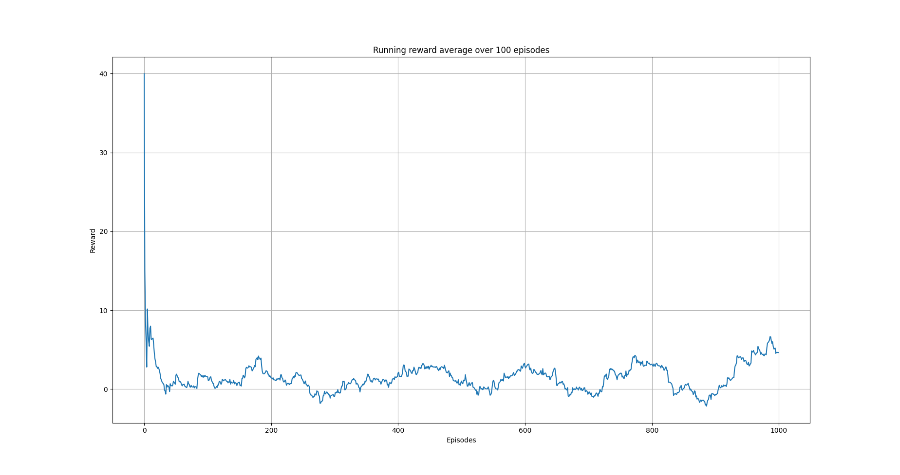
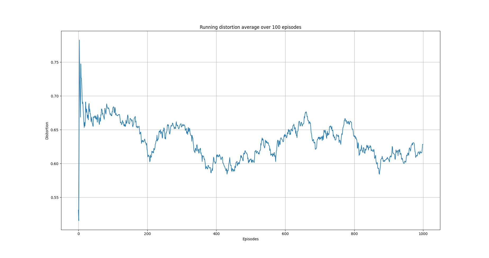

Semi-gradient SARSA algorithm on mock data set
=========================================================

Overview
--------

In this example, we use the episodic semi-gradient SARSA algorithm to anonymize a data set.

Semi-gradient SARSA algorithm 
-----------------------------

One of the major disadvantages of Qlearning we saw in the previous examples, is that we need to use a tabular representation
of the state-action space. This poses limitations on how large the state space can be on current machines; for a data set with, say, 5 columns when each  
is discretized using 10 bins, this creates a state space of the the order :math:`O(10^5)`. Although we won't address this here,
we want to introduce the idea of weighting the columns. This idea comes from the fact that possibly not all columns carry the same
information regarding anonimity and data set utility. Implicitly we decode this belief by categorizing the columns as

.. code-block::

	ColumnType.IDENTIFYING_ATTRIBUTE
	ColumnType.QUASI_IDENTIFYING_ATTRIBUTE
	ColumnType.SENSITIVE_ATTRIBUTE
	ColumnType.INSENSITIVE_ATTRIBUTE 

Thus, in this example, instead to representing the state-action function :math:`q_{\pi}` using a table as we did in `Q-learning on a three columns dataset <qlearning_three_columns.html>`_, we will assume  a functional form for  it. Specifically, we assume that the state-action function can be approximated by :math:`\hat{q} \approx q_{\pi}` given by 

.. math::
	\hat{q}(s, a) = \mathbf{w}^T\mathbf{x}(s, a) = \sum_{i}^{d} w_i, x_i(s, a)

where :math:`\mathbf{w}` is the weights vector and :math:`\mathbf{x}(s, a)` is called the feature vector representing state :math:`s` when taking action :math:`a` [1]. We will use `Tile coding`_ to construct :math:`\mathbf{x}(s, \alpha)`.  Our goal now is to find the components of the weight vector. 
We can use stochastic gradient descent (or SGD ) for this [1]. In this case, the update rule is [1]

.. math::
   \mathbf{w}_{t + 1} = \mathbf{w}_t + \alpha\left[U_t - \gamma \hat{q}(s_t, a_t, \mathbf{w}_t)\right] \nabla_{\mathbf{w}} \hat{q}(s_t, a_t, \mathbf{w}_t)
   
where :math:`\alpha` is the learning rate and :math:`U_t`, for one-step SARSA, is given by [1]:

.. math::
   U_t = R_t + \gamma \hat{q}(s_{t + 1}, a_{t + 1}, \mathbf{w}_t)

Since, :math:`\hat{q}(s, a)` is a linear function with respect to the weights, its gradient is given by

.. math::
   \nabla_{\mathbf{w}} \hat{q}(s, a) = \mathbf{x}(s, a)

The semi-gradient SARSA algorithm is shown below

.. figure:: images/semi_gradient_sarsa.png 

   Episodic semi-gradient SARSA algorithm. Image from [1].
 
 
Tile coding
-------------

Since we consider all the columns distortions in the data set, means that we deal with a multi-dimensional continuous spaces. In this case,
we can use tile coding to construct :math:`\mathbf{x}(s, \alpha)` [1].

Tile coding is a form of coarse coding for multi-dimensional continuous spaces [1]. In this method, the features are grouped into partitions of the state
space. Each partition is called a tiling, and each element of the partition is called a
tile [1]. The following figure shows the a 2D state space partitioned in a uniform grid (left).
If we only use this tiling,  we would not have coarse coding but just a case of state aggregation.

In order to apply coarse coding, we use overlapping tiling partitions. In this case, each tiling is offset by a fraction of a tile width [1].
A simple case with four tilings is shown on the right side of following figure. 

.. figure:: images/tiling_example.png

   Multiple, overlapping grid-tilings on a limited two-dimensional space. 
   These tilings are offset from one another by a uniform amount in each dimension. Image from [1].

One practical advantage of tile coding is that the overall number of features that are active 
at a given instance is the same for any state [1]. Exactly one feature is present in each tiling, so the total number of features present is
always the same as the number of tilings [1]. This allows the learning parameter :math:`\eta`, to be set according to

.. math::
   \eta = \frac{1}{n}
   
   
where :math:`n` is the number of tilings. 

Code
----

The necessary imports

.. code-block::

	import random
	import numpy as np

	from src.algorithms.semi_gradient_sarsa import SemiGradSARSAConfig, SemiGradSARSA
	from src.spaces.tiled_environment import TiledEnv, TiledEnvConfig, Layer

	from src.spaces.action_space import ActionSpace
	from src.spaces.actions import ActionIdentity, ActionStringGeneralize, ActionNumericBinGeneralize
	from src.trainers.trainer import Trainer, TrainerConfig
	from src.policies.epsilon_greedy_policy import EpsilonDecayOption
	from src.algorithms.epsilon_greedy_q_estimator import EpsilonGreedyQEstimatorConfig, EpsilonGreedyQEstimator
	from src.datasets import ColumnType
	from src.spaces.env_type import DiscreteEnvType
	from src.examples.helpers.load_full_mock_dataset import load_discrete_env, get_ethinicity_hierarchy, \
	    get_gender_hierarchy, get_salary_bins, load_mock_subjects
	from src.examples.helpers.plot_utils import plot_running_avg
	from src.utils import INFO
	
Next we set some constants

.. code-block::

	N_STATES = 10
	N_LAYERS = 5
	N_BINS = 10
	N_EPISODES = 10001
	OUTPUT_MSG_FREQUENCY = 100
	GAMMA = 0.99
	ALPHA = 0.1
	N_ITRS_PER_EPISODE = 30
	EPS = 1.0
	EPSILON_DECAY_OPTION = EpsilonDecayOption.CONSTANT_RATE
	EPSILON_DECAY_FACTOR = 0.01
	MAX_DISTORTION = 0.7
	MIN_DISTORTION = 0.4
	OUT_OF_MAX_BOUND_REWARD = -1.0
	OUT_OF_MIN_BOUND_REWARD = -1.0
	IN_BOUNDS_REWARD = 5.0
	N_ROUNDS_BELOW_MIN_DISTORTION = 10
	SAVE_DISTORTED_SETS_DIR = "semi_grad_sarsa_all_columns/distorted_set"
	PUNISH_FACTOR = 2.0
	USE_IDENTIFYING_COLUMNS_DIST = True
	IDENTIFY_COLUMN_DIST_FACTOR = 0.1

The driver code brings all elements together

.. code-block::

	if __name__ == '__main__':

	    # set the seed for random engine
	    random.seed(42)

	    # specify the column types. An identifying column
	    # will me removed from the anonymized data set
	    # An  INSENSITIVE_ATTRIBUTE remains intact.
	    # A QUASI_IDENTIFYING_ATTRIBUTE is used in the anonymization
	    # A SENSITIVE_ATTRIBUTE currently remains intact
	    column_types = {"NHSno": ColumnType.IDENTIFYING_ATTRIBUTE,
		            "given_name": ColumnType.IDENTIFYING_ATTRIBUTE,
		            "surname": ColumnType.IDENTIFYING_ATTRIBUTE,
		            "gender": ColumnType.QUASI_IDENTIFYING_ATTRIBUTE,
		            "dob": ColumnType.SENSITIVE_ATTRIBUTE,
		            "ethnicity": ColumnType.QUASI_IDENTIFYING_ATTRIBUTE,
		            "education": ColumnType.SENSITIVE_ATTRIBUTE,
		            "salary": ColumnType.QUASI_IDENTIFYING_ATTRIBUTE,
		            "mutation_status": ColumnType.SENSITIVE_ATTRIBUTE,
		            "preventative_treatment": ColumnType.SENSITIVE_ATTRIBUTE,
		            "diagnosis": ColumnType.INSENSITIVE_ATTRIBUTE}

	    # define the action space
	    action_space = ActionSpace(n=10)

	    # all the columns that are SENSITIVE_ATTRIBUTE will be kept as they are
	    # because currently we have no model
	    # also INSENSITIVE_ATTRIBUTE will be kept as is
	    # in order to declare this we use an ActionIdentity
	    action_space.add_many(ActionIdentity(column_name="dob"),
		                  ActionIdentity(column_name="education"),
		                  ActionIdentity(column_name="salary"),
		                  ActionIdentity(column_name="diagnosis"),
		                  ActionIdentity(column_name="mutation_status"),
		                  ActionIdentity(column_name="preventative_treatment"),
		                  ActionIdentity(column_name="ethnicity"),
		                  ActionStringGeneralize(column_name="ethnicity",
		                                         generalization_table=get_ethinicity_hierarchy()),
		                  ActionStringGeneralize(column_name="gender",
		                                         generalization_table=get_gender_hierarchy()),
		                  ActionNumericBinGeneralize(column_name="salary",
		                                             generalization_table=get_salary_bins(ds=load_mock_subjects(),
		                                                                                  n_states=N_STATES)))

	    action_space.shuffle()

	    # load the discrete environment
	    env = load_discrete_env(env_type=DiscreteEnvType.MULTI_COLUMN_STATE, n_states=N_STATES,
		                    min_distortion={"ethnicity": 0.133, "salary": 0.133, "gender": 0.133,
		                                    "dob": 0.0, "education": 0.0, "diagnosis": 0.0,
		                                    "mutation_status": 0.0, "preventative_treatment": 0.0,
		                                    "NHSno": 0.0, "given_name": 0.0, "surname": 0.0},
		                    max_distortion={"ethnicity": 0.133, "salary": 0.133, "gender": 0.133,
		                                    "dob": 0.0, "education": 0.0, "diagnosis": 0.0,
		                                    "mutation_status": 0.0, "preventative_treatment": 0.0,
		                                    "NHSno": 0.1, "given_name": 0.1, "surname": 0.1},
		                    total_min_distortion=MIN_DISTORTION, total_max_distortion=MAX_DISTORTION,
		                    out_of_max_bound_reward=OUT_OF_MAX_BOUND_REWARD,
		                    out_of_min_bound_reward=OUT_OF_MIN_BOUND_REWARD,
		                    in_bounds_reward=IN_BOUNDS_REWARD,
		                    punish_factor=PUNISH_FACTOR,
		                    column_types=column_types,
		                    action_space=action_space,
		                    save_distoreted_sets_dir=SAVE_DISTORTED_SETS_DIR,
		                    use_identifying_column_dist_in_total_dist=USE_IDENTIFYING_COLUMNS_DIST,
		                    use_identifying_column_dist_factor=IDENTIFY_COLUMN_DIST_FACTOR,
		                    gamma=GAMMA,
		                    n_rounds_below_min_distortion=N_ROUNDS_BELOW_MIN_DISTORTION)

	    # the configuration for the Tiled environment
	    tiled_env_config = TiledEnvConfig(n_layers=N_LAYERS, n_bins=N_BINS,
		                              env=env,
		                              column_ranges={"gender": [0.0, 1.0],
		                                             "ethnicity": [0.0, 1.0],
		                                             "salary": [0.0, 1.0]})

	    # create the Tiled environment
	    tiled_env = TiledEnv(tiled_env_config)
	    tiled_env.create_tiles()

	    # agent configuration
	    agent_config = SemiGradSARSAConfig(gamma=GAMMA, alpha=ALPHA, n_itrs_per_episode=N_ITRS_PER_EPISODE,
		                               policy=EpsilonGreedyQEstimator(EpsilonGreedyQEstimatorConfig(eps=EPS, n_actions=tiled_env.n_actions,
		                                                                                            decay_op=EPSILON_DECAY_OPTION,
		                                                                                            epsilon_decay_factor=EPSILON_DECAY_FACTOR,
		                                                                                            env=tiled_env,
		                                                                                            gamma=GAMMA,
		                                                                                            alpha=ALPHA)))
	    # create the agent
	    agent = SemiGradSARSA(agent_config)

	    # create a trainer to train the SemiGradSARSA agent
	    trainer_config = TrainerConfig(n_episodes=N_EPISODES, output_msg_frequency=OUTPUT_MSG_FREQUENCY)
	    trainer = Trainer(env=tiled_env, agent=agent, configuration=trainer_config)

	    # train the agent
	    trainer.train()

	    # avg_rewards = trainer.avg_rewards()
	    avg_rewards = trainer.total_rewards
	    plot_running_avg(avg_rewards, steps=100,
		             xlabel="Episodes", ylabel="Reward",
		             title="Running reward average over 100 episodes")

	    avg_episode_dist = np.array(trainer.total_distortions)
	    print("{0} Max/Min distortion {1}/{2}".format(INFO, np.max(avg_episode_dist), np.min(avg_episode_dist)))

	    plot_running_avg(avg_episode_dist, steps=100,
		             xlabel="Episodes", ylabel="Distortion",
		             title="Running distortion average over 100 episodes")

  

   Running average reward.

   Running average total distortion.
   
The images above illustrate that there is clear evidence of learning as it was when using Qlearning. Furthermore, the training time is a lot more than
the simple Qlearning algorithm. Thus, with the current implementation of semi0gradient SARSA we do not have any clear advantage. Instead, it could be argued
that we maintain the constraints related with Qlearning (this comes form the tiling approach we used) without and clear advantage.
   
References
----------

1. Richard S. Sutton and Andrw G. Barto, Reinforcement Learning. An Introduction 2nd Edition, MIT Press.
