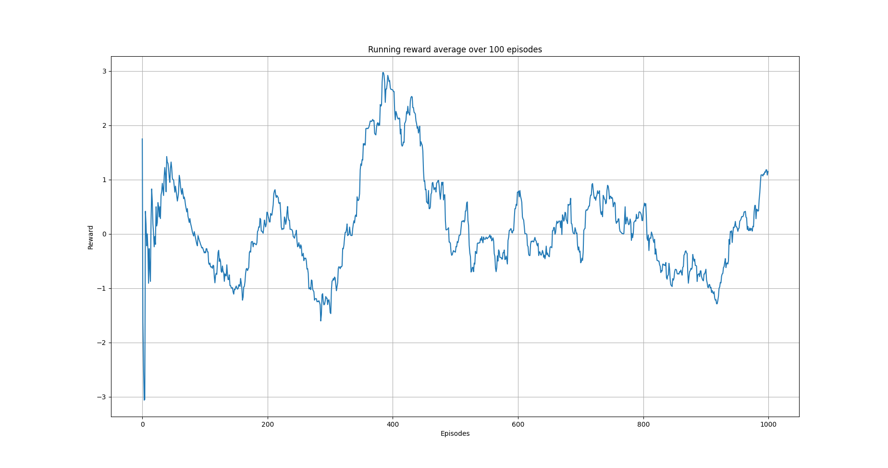
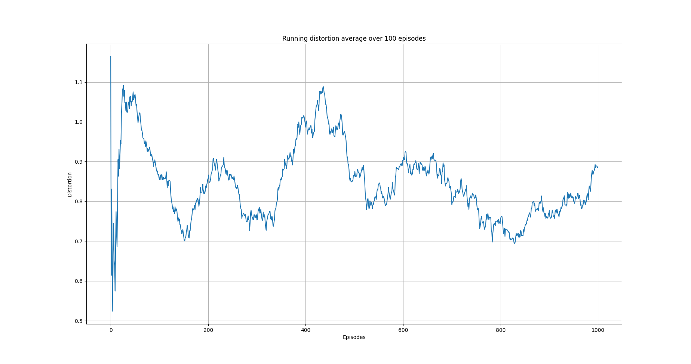

Semi-gradient SARSA algorithm 
=============================

Overview
--------

In this example, we use the episodic semi-gradient SARSA algorithm to anonymize a data set with three columns.

Semi-gradient SARSA algorithm 
-----------------------------

In this example, we continue using a three-column data set as in the `Q-learning on a three columns dataset <qlearning_three_columns.html>`_.
In that example, we used state aggregation to model the overall distortion of the data set in the range :math:`[0, 1]`. 
Herein, we take an alternative approach. We will assume that the column distortion is in the range :math:`[0, 1]` where the edge points mean no distortion
and full distortion of the column respectively.  For each column, we will use the same methodology as in `Q-learning on a three columns dataset <qlearning_three_columns.html>`_ to discretize the continuous :math:`[0, 1]` range into a given number of disjoint bins.

Contrary to representing the state-action function :math:`q_{\pi}` using a table as we did in `Q-learning on a three columns dataset <qlearning_three_columns.html>`_, we will assume  a functional form for 
it. Specifically, we assume that the state-action function can be approximated by :math:`\hat{q} \approx q_{\pi}` given by 

.. math::
	\hat{q}(s, \alpha) = \mathbf{w}^T\mathbf{x}(s, \alpha) = \sum_{i}^{d} w_i, x_i(s, \alpha)

where :math:`\mathbf{w}` is the weights vector and :math:`\mathbf{x}(s, \alpha)` is called the feature vector representing state :math:`s` when taking action :math:`\alpha` [1]. We will use `Tile coding`_ to construct :math:`\mathbf{x}(s, \alpha)`.  Our goal now is to find the components of the weight vector. 
We can use stochastic gradient descent (or SGD ) for this [1]. In this case, the update rule is [1]

.. math::
   \mathbf{w}_{t + 1} = \mathbf{w}_t + \eta\left[U_t - \gamma \hat{q}(s_t, \alpha_t, \mathbf{w}_t)\right] \nabla_{\mathbf{w}} \hat{q}(s_t, \alpha_t, \mathbf{w}_t)
   
where :math:`\eta` is the learning rate and :math:`U_t`, for one-step SARSA, is given by [1]:

.. math::
   U_t = R_t + \gamma \hat{q}(s_{t + 1}, \alpha_{t + 1}, \mathbf{w}_t)

Since, :math:`\hat{q}(s, \alpha)` is a linear function with respect to the weights, its gradient is given by

.. math::
   \nabla_{\mathbf{w}} \hat{q}(s, \alpha) = \mathbf{x}(s, \alpha)

The semi-gradient SARSA algorithm is shown below

.. figure:: images/semi_gradient_sarsa.png 

   Episodic semi-gradient SARSA algorithm. Image from [1].
 
 
Tile coding
-------------

Since we consider all the columns distortions in the data set, means that we deal with a multi-dimensional continuous spaces. In this case,
we can use tile coding to construct :math:`\mathbf{x}(s, \alpha)` [1].

Tile coding is a form of coarse coding for multi-dimensional continuous spaces [1]. In this method, the features are grouped into partitions of the state
space. Each partition is called a tiling, and each element of the partition is called a
tile [1]. The following figure shows the a 2D state space partitioned in a uniform grid (left).
If we only use this tiling,  we would not have coarse coding but just a case of state aggregation.

In order to apply coarse coding, we use overlapping tiling partitions. In this case, each tiling is offset by a fraction of a tile width [1].
A simple case with four tilings is shown on the right side of following figure. 

We will use a linear function approximation for :math:`\hat{q}`:

.. figure:: images/tiling_example.png

   Multiple, overlapping grid-tilings on a limited two-dimensional space. 
   These tilings are offset from one another by a uniform amount in each dimension. Image from [1].

One practical advantage of tile coding is that the overall number of features that are active 
at a given instance is the same for any state [1]. Exactly one feature is present in each tiling, so the total number of features present is
always the same as the number of tilings [1]. This allows the learning parameter :math:`\eta`, to be set according to

.. math::
   \eta = \frac{1}{n}
   
   
where :math:`n` is the number of tilings. 

Code
----

The necessary imports

.. code-block::

	import random
	from pathlib import Path
	import numpy as np

	from src.algorithms.semi_gradient_sarsa import SemiGradSARSAConfig, SemiGradSARSA
	from src.utils.serial_hierarchy import SerialHierarchy
	from src.spaces.tiled_environment import TiledEnv, TiledEnvConfig, Layer
	from src.spaces.discrete_state_environment import DiscreteStateEnvironment
	from src.datasets.datasets_loaders import MockSubjectsLoader, MockSubjectsData
	from src.spaces.action_space import ActionSpace
	from src.spaces.actions import ActionIdentity, ActionStringGeneralize, ActionNumericBinGeneralize
	from src.algorithms.trainer import Trainer
	from src.policies.epsilon_greedy_policy import EpsilonDecayOption
	from src.algorithms.epsilon_greedy_q_estimator import EpsilonGreedyQEstimatorConfig, EpsilonGreedyQEstimator
	from src.utils.distortion_calculator import DistortionCalculationType, DistortionCalculator
	from src.utils.numeric_distance_type import NumericDistanceType
	from src.utils.string_distance_calculator import StringDistanceType
	from src.utils.reward_manager import RewardManager

Next we set some constants

.. code-block::

	N_LAYERS = 5
	N_BINS = 10
	N_EPISODES = 1000
	OUTPUT_MSG_FREQUENCY = 100
	GAMMA = 0.99
	ALPHA = 0.1
	N_ITRS_PER_EPISODE = 30
	EPS = 1.0
	EPSILON_DECAY_OPTION = EpsilonDecayOption.CONSTANT_RATE #.INVERSE_STEP
	EPSILON_DECAY_FACTOR = 0.01
	MAX_DISTORTION = 0.7
	MIN_DISTORTION = 0.3
	OUT_OF_MAX_BOUND_REWARD = -1.0
	OUT_OF_MIN_BOUND_REWARD = -1.0
	IN_BOUNDS_REWARD = 5.0
	N_ROUNDS_BELOW_MIN_DISTORTION = 10
	SAVE_DISTORTED_SETS_DIR = "/home/alex/qi3/drl_anonymity/src/examples/semi_grad_sarsa/distorted_set"
	REWARD_FACTOR = 0.95
	PUNISH_FACTOR = 2.0

We continue by establishing some helper functions

.. code-block::

	def get_ethinicity_hierarchy():
	    ethnicity_hierarchy = SerialHierarchy(values={})

	    ethnicity_hierarchy["Mixed White/Asian"] = "White/Asian"
	    ethnicity_hierarchy["White/Asian"] = "Mixed"

	    ethnicity_hierarchy["Chinese"] = "Asian"
	    ethnicity_hierarchy["Indian"] = "Asian"
	    ethnicity_hierarchy["Mixed White/Black African"] = "White/Black"
	    ethnicity_hierarchy["White/Black"] = "Mixed"

	    ethnicity_hierarchy["Black African"] = "African"
	    ethnicity_hierarchy["African"] = "Black"
	    ethnicity_hierarchy["Asian other"] = "Asian"
	    ethnicity_hierarchy["Black other"] = "Black"
	    ethnicity_hierarchy["Mixed White/Black Caribbean"] = "White/Black"
	    ethnicity_hierarchy["White/Black"] = "Mixed"

	    ethnicity_hierarchy["Mixed other"] = "Mixed"
	    ethnicity_hierarchy["Arab"] = "Asian"
	    ethnicity_hierarchy["White Irish"] = "Irish"
	    ethnicity_hierarchy["Irish"] = "European"
	    ethnicity_hierarchy["Not stated"] = "Not stated"
	    ethnicity_hierarchy["White Gypsy/Traveller"] = "White"
	    ethnicity_hierarchy["White British"] = "British"
	    ethnicity_hierarchy["British"] = "European"
	    ethnicity_hierarchy["Bangladeshi"] = "Asian"
	    ethnicity_hierarchy["White other"] = "White"
	    ethnicity_hierarchy["Black Caribbean"] = "Caribbean"
	    ethnicity_hierarchy["Caribbean"] = "Black"
	    ethnicity_hierarchy["Pakistani"] = "Asian"

	    ethnicity_hierarchy["European"] = "European"
	    ethnicity_hierarchy["Mixed"] = "Mixed"
	    ethnicity_hierarchy["Asian"] = "Asian"
	    ethnicity_hierarchy["Black"] = "Black"
	    ethnicity_hierarchy["White"] = "White"
	    return ethnicity_hierarchy

	def load_mock_subjects() -> MockSubjectsLoader:

	    mock_data = MockSubjectsData(FILENAME=Path("../../data/mocksubjects.csv"),
		                         COLUMNS_TYPES={"ethnicity": str, "salary": float, "diagnosis": int},
		                         FEATURES_DROP_NAMES=["NHSno", "given_name",
		                                              "surname", "dob"] + ["preventative_treatment",
		                                                                   "gender", "education", "mutation_status"],
		                         NORMALIZED_COLUMNS=["salary"])

	    ds = MockSubjectsLoader(mock_data)

	    assert ds.n_columns == 3, "Invalid number of columns {0} not equal to 3".format(ds.n_columns)

	    return ds

	def load_discrete_env() -> DiscreteStateEnvironment:

		mock_ds = load_mock_subjects()

		# create bins for the salary generalization
		unique_salary = mock_ds.get_column_unique_values(col_name="salary")
		unique_salary.sort()

		# modify slightly the max value because
		# we get out of bounds for the maximum salary
		bins = np.linspace(unique_salary[0], unique_salary[-1] + 1, N_BINS)

		action_space = ActionSpace(n=5)
		action_space.add_many(ActionIdentity(column_name="ethnicity"),
		                      ActionStringGeneralize(column_name="ethnicity",
		                                             generalization_table=get_ethinicity_hierarchy()),
		                      ActionIdentity(column_name="salary"),
		                      ActionNumericBinGeneralize(column_name="salary", generalization_table=bins),
		                      ActionIdentity(column_name="diagnosis"))

		action_space.shuffle()

		env = DiscreteStateEnvironment.from_options(data_set=mock_ds,
		                                            action_space=action_space,
		                                            distortion_calculator=DistortionCalculator(
		                                                numeric_column_distortion_metric_type=NumericDistanceType.L2_AVG,
		                                                string_column_distortion_metric_type=StringDistanceType.COSINE_NORMALIZE,
		                                                dataset_distortion_type=DistortionCalculationType.SUM),
		                                            reward_manager=RewardManager(bounds=(MIN_DISTORTION, MAX_DISTORTION),
		                                                                         out_of_max_bound_reward=OUT_OF_MAX_BOUND_REWARD,
		                                                                         out_of_min_bound_reward=OUT_OF_MIN_BOUND_REWARD,
		                                                                         in_bounds_reward=IN_BOUNDS_REWARD),
		                                            gamma=GAMMA,
		                                            reward_factor=REWARD_FACTOR,
		                                            punish_factor=PUNISH_FACTOR,
		                                            min_distortion=MIN_DISTORTION, max_distortion=MAX_DISTORTION,
		                                            n_rounds_below_min_distortion=N_ROUNDS_BELOW_MIN_DISTORTION,
		                                            distorted_set_path=Path(SAVE_DISTORTED_SETS_DIR),
		                                            n_states=N_LAYERS * Layer.n_tiles_per_action(N_BINS,
		                                                                                         mock_ds.n_columns))

		return env

The driver code brings all elements together

.. code-block::

	if __name__ == '__main__':

	    # set the seed for random engine
	    random.seed(42)

	    discrete_env = load_discrete_env()
	    tiled_env_config = TiledEnvConfig(n_layers=N_LAYERS, n_bins=N_BINS,
		                              env=discrete_env,
		                              column_ranges={"ethnicity": [0.0, 1.0],
		                                             "salary": [0.0, 1.0],
		                                             "diagnosis": [0.0, 1.0]})
	    tiled_env = TiledEnv(tiled_env_config)
	    tiled_env.create_tiles()

	    configuration = {"n_episodes": N_EPISODES, "output_msg_frequency": OUTPUT_MSG_FREQUENCY}

	    agent_config = SemiGradSARSAConfig(gamma=GAMMA, alpha=ALPHA, n_itrs_per_episode=N_ITRS_PER_EPISODE,
		                               policy=EpsilonGreedyQEstimator(EpsilonGreedyQEstimatorConfig(eps=EPS, n_actions=tiled_env.n_actions,
		                                                                                            decay_op=EPSILON_DECAY_OPTION,
		                                                                                            epsilon_decay_factor=EPSILON_DECAY_FACTOR,
		                                                                                            env=tiled_env, gamma=GAMMA, alpha=ALPHA)))
	    agent = SemiGradSARSA(agent_config)

	    # create a trainer to train the Qlearning agent
	    trainer = Trainer(env=tiled_env, agent=agent, configuration=configuration)
	    trainer.train()

  

   
References
----------

1. Richard S. Sutton and Andrw G. Barto, Reinforcement Learning. An Introduction 2nd Edition, MIT Press.
